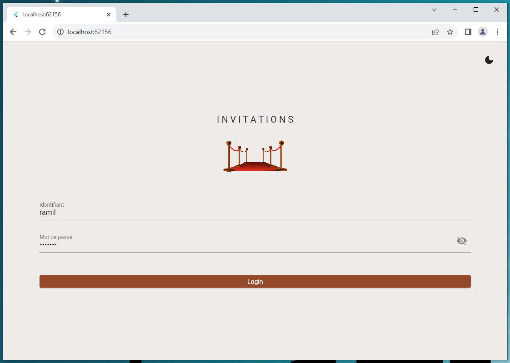

# Event-Invites App by Ramil K.
This repository contains the release files and the source files of this app.
*The app has a light and dark mode.*

## Release files :
The source files are located inside /evo_app/release
It contains the release files for :

 - Windows : .exe file
	Just unzip the file and launch the .exe file.
 - Android : .apk file
   Install the .api file on your Android device/emulator
 - Web : HTML CSS JS files
	You will need a webservice to run the web files, here is a demo link : https://ramilcode.github.io/eve_app/release/web/ 
	**Important: CORS (Cross-Origin Resource Sharing) headers must be set on the backend server side for this to work, else the requests will fail.**

## Source files :
The source files are located inside /evo_app/src

### To debug the project :
Install Flutter on your device, go to /src/eve_app and type **"flutter pub get"** inside your terminal.

## Images :

### Android :

### Windows :

### Web (local) :

### Web (local) :

